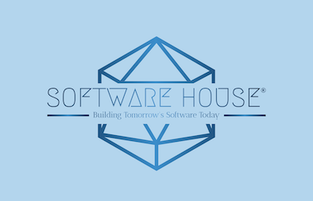

<h1 align="center">The Final Project - Software House</h1>

 
 

## 	:pen: The Project's Inception Story

:black_circle:Let's imagine we have established "Software House" and have successfully delivered various software development projects. 
:black_circle:As our reputation grows, an e-commerce website manager approaches us with a request. 
:black_circle:They want to outperform their major competitor by continuously monitoring and matching their competitor's prices. 
:black_circle:If the competitor lowers prices or offers discounts, they want to do the same. 

### Customer Needs

:large_blue_circle:The customer requires a bot application capable of scraping their competitor's products. 
:large_blue_circle:The bot should allow the customer to choose between scraping all products or a specific number of products. 
:large_blue_circle:The customer should be able to specify whether to scrape only products on sale, products not on sale, or all products. 
:large_blue_circle:The customer wants to track the bot's progress and activities through a console (log) screen in the web application. 
:large_blue_circle:After scraping the products, the customer wants to be able to view them in a panel provided by us. 
:large_blue_circle:The scraped products should be saved as an Excel file, allowing the customer to import them into their own system. 
:large_blue_circle:The customer would appreciate receiving both an in-app notification and an email when the scraping process is completed. 
:large_blue_circle:It would be preferable to have the option to enable or disable this notification feature in the application settings. 

Competitor's Website Address: [https://finalproject.dotnet.gg](https://finalproject.dotnet.gg/)

---

## 	:globe_with_meridians: Technologies

The project incorporates a range of technologies to deliver its functionality:

:white_small_square:__Language:__ The project is primarily developed using C#, a powerful and versatile programming language.

:white_small_square:**Framework:** It leverages the .NET 7 framework, which offers a comprehensive set of tools and libraries for developing modern and scalable applications.

:white_small_square:**Architecture:** The project follows the Clean Architecture principles, promoting separation of concerns and maintainability through clear architectural layers.

:white_small_square:**Web Scraping:** For web scraping capabilities, the project utilizes Selenium, a popular and flexible framework for automating web browsers.

:white_small_square:**Database:** The project integrates with Entity Framework Core for database operations. It utilizes MariaDB as the underlying database engine.

:white_small_square:**CQRS:** The project implements the CQRS (Command Query Responsibility Segregation) pattern using MediatR, enabling a clear separation of commands and queries for improved code organization and scalability.

:white_small_square:**Real-time Communication:** It employs SignalR from Microsoft.AspNetCore.SignalR to enable real-time communication between the server and clients, facilitating interactive and responsive user experiences.

:white_small_square:**[ASP.NET](http://asp.net/) 7 with Entity Framework Core:** The project utilizes the latest version of ASP.NET 7 and integrates it seamlessly with Entity Framework Core for efficient web development and data access.

:white_small_square:**Blazor WebAssembly:** The project incorporates Blazor WebAssembly for building rich and interactive web-based user interfaces, providing a smooth and responsive user experience.

:white_small_square:**SMTP Email:** For sending emails, the project integrates SMTP (Simple Mail Transfer Protocol), a widely used protocol for email transmission, ensuring reliable and efficient email delivery.

:white_small_square:**OfficeOpenXml:** It utilizes the OfficeOpenXml library for working with Excel files, enabling the generation, manipulation, and reading of Excel documents within the application.

## :diamond_shape_with_a_dot_inside: Project Structure

The project is structured following the principles of Clean Architecture which organized into six main layers, each serving a specific purpose:

:small_blue_diamond: Web Api: Acting as the entry point and user interface layer, the Web Api provides RESTful APIs for seamless interaction with the crawler functionality. It handles incoming requests and facilitates communication between clients and the application.

:small_blue_diamond: Application: The Application layer contains the core logic and use cases of the project. It defines interfaces for services and coordinates the flow of data between different layers. This layer is responsible for executing business rules and implementing application-specific operations.

:small_blue_diamond: Domain:The Domain layer encapsulates the essential domain models and implements the business logic of the application. It represents the fundamental concepts and rules of the problem domain. Here, the core entities, value objects, and business rules are defined.

:small_blue_diamond: Infrastructure: The Infrastructure layer handles the implementation of infrastructure-specific details, such as data access and integration with external services. It interacts with databases, external APIs, and other necessary services to ensure smooth operation. This layer provides the necessary infrastructure components for the application to function.

:small_blue_diamond: Wasm: The Wasm layer comprises the Blazor web application, which offers an immersive and dynamic user interface. By leveraging the power of Blazor, this layer enhances the overall user experience with interactive features, enabling rich client-side functionality and responsive UI components.

:small_blue_diamond: Crawler: The Crawler layer consists of the console application responsible for web scraping and data extraction tasks. It utilizes the latest technologies to efficiently crawl web pages and extract relevant information. This layer handles the data acquisition and prepares it for further processing within the application.

By adopting this architectural structure, the project gains maintainability, scalability, and testability. It promotes code reusability and separation of concerns, enabling developers to focus on specific layers without impacting the overall functionality of the system.

---

## :triangular_flag_on_post: Getting Started

To run the project; 
### Configuration Settings
To configure the database connection; 
:white_check_mark: You can make use of the configuration files, specifically the 'appsettings.json' file. These files provide a way to define and customize settings for your application, including the database connection string. By modifying the values in the 'appsettings.json' file, you can easily configure the application to use the desired database and other related settings.
### Edit Configurations
You can navigate to the "Edit Run Configurations" section and run the following projects in the specified order: 
:white_check_mark: "WebApi" 
:white_check_mark: "SoftwareHouse.CrawlerConsole" 
:white_check_mark: "SoftwareHouse.Wasm" 
By running these projects simultaneously, you will be able to start the Web API, the Crawler Console, and the Wasm applications concurrently. This setup ensures that all the necessary components of the project are running together, enabling seamless communication and functionality between them.

